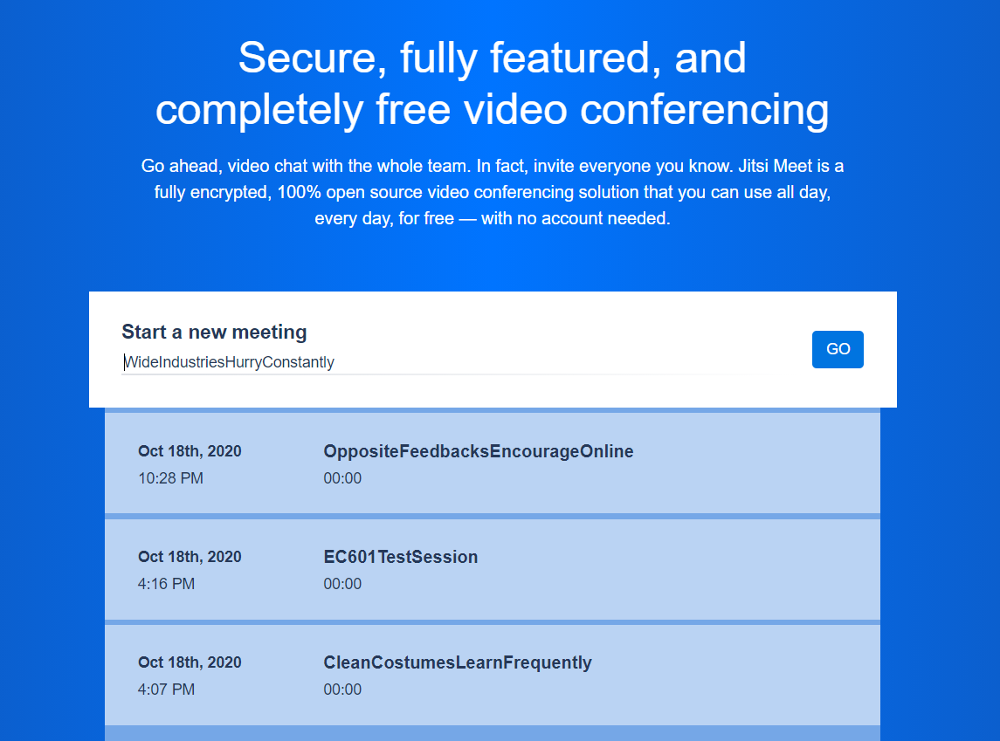

# EC601-OpenSource-Project3
Project 3 opensource implementation of Jitsi Meet 

As you can see, there is no code in this project. The code is all online on the Jitsi Meet webpage.
## Phase 1: Open Source Implementation
The specific implementation used is a Docker Container running a basic Jitsi Meet Server. 

Here is a link to the guide I used: https://jitsi.github.io/handbook/docs/devops-guide/devops-guide-quickstart

Here is a sample output from the session running: 

I am using a Windows 10 Home edition laptop and that requires me to use Docker on a VM (Docker Toolbox). In addition, ports 8443 needs to be forwarded from device to VM. Port 10000 for UDP needs to be opened as well. Port 8443 is for HTTPS connections and is used for data transfer. Port 10000 is used for the actual RTP packets so it needs to be opened for UDP transfers.

## Phase 2: Security/Architecture Analysis
The way Jitsi Meet is designed can be explained in this graphic:

The server uses XMPP  in order to accomplish its signalling tasks. So, looking into the logs for this might give insight into any security flaws of the signalling layer.

In order to see the logs, we use the given default XMPP Credentials (can be located on the installation guide). 

